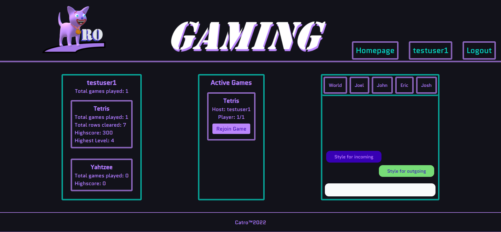

# Catro-Gaming

## Description

Catro-Gaming is a scalable arcade gaming application designed to give users a central hub to play their favorite games. The platform was based on the MERN stack, as well as using Apollo to put a GraphQL interface over the MongoDB backend. Styling was accomplished with Tailwindcss and associated plugins.

## Table of Contents

- [Installation](#installation)
- [Usage](#usage)
- [Heroku](#heroku)
- [License](#license)
- [Contributors](#contributors)
- [Credits](#credits)
- [Questions](#questions)
- [Links](#links)

## Installation

First, clone the repository to your local machine with `git clone <url>`. Then, install all required dependencies with `npm i`.

## Usage

Run the application locally with `npm start`.

## Heroku 

Follow this link to view our project hosted on Heroku [here](https://catro-gaming.herokuapp.com).

## License
Copyright © 2022 JoelKovalcson, JMaurizio, ericc97, and jaywooski

[The ISC License](https://www.isc.org/licenses/)

Permission to use, copy, modify, and/or distribute this software for any purpose with or without fee is not granted unless provided written consent. The above copyright notice and this permission notice shall appear in all copies.

THE SOFTWARE IS PROVIDED “AS IS” AND ISC DISCLAIMS ALL WARRANTIES WITH REGARD TO THIS SOFTWARE INCLUDING ALL IMPLIED WARRANTIES OF MERCHANTABILITY AND FITNESS. IN NO EVENT SHALL ISC BE LIABLE FOR ANY SPECIAL, DIRECT, INDIRECT, OR CONSEQUENTIAL DAMAGES OR ANY DAMAGES WHATSOEVER RESULTING FROM LOSS OF USE, DATA OR PROFITS, WHETHER IN AN ACTION OF CONTRACT, NEGLIGENCE OR OTHER TORTIOUS ACTION, ARISING OUT OF OR IN CONNECTION WITH THE USE OR PERFORMANCE OF THIS SOFTWARE.

## Contributors
Joel Kovalcson (https://github.com/JoelKovalcson), Joshua Maurizio (https://github.com/JMaurizio), Eric Coleman (https://github.com/ericc97), John Wooley (https://github.com/jaywooski)

## Contributions\Self Worth

### John Wooley
Front-End Development (React): Logo, Heading, Styling, Entertainment - John

### Josh Maurizio
Mobile responsiveness, Styling, Yahtzee setup

### Joel Kovalcson
Worked on dynamically displaying content through React and implemented game logic. Also worked on implementation and building of the backend server.

### Eric Coleman
Worked on planning, building and implementing the backend server. Also worked on writing mutation and queries to display data from the server on the front end.
## Questions

With any questions email the repository owners at John Wooley (john.m.wooley@gmail.com), Josh Maurizio (josh.maurizio@gmail.com), Eric Coleman (ericcoleman9217@gmail.com), Joel Kovalcson ()

## Links

Github Repository Link: https://github.com/JoelKovalcson/Catro-Gaming
Heroku Deployment Link: https://catro-gaming.herokuapp.com
